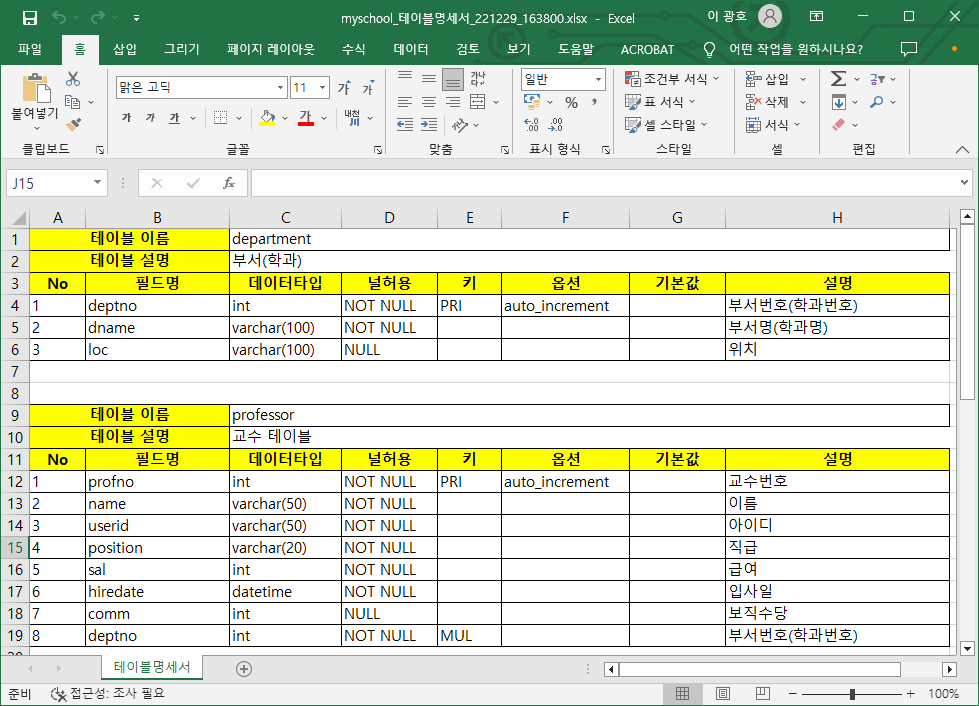

# MySQL 테이블 명세서 생성 프로그램

MySQL의 테이블 명세서를 생성하는 Node 프로그램입니다.

## 사용 방법

### 1) 패키지 설치

```shell
yarn install
```

### 2) 설정파일 수정

`config.env.sample` 파일의 이름을 `config.env`으로 수정하고, 본인의 데이터베이스 환경에 맞게 수정합니다.

### 3) 명령프롬프트 상에서 실행

cmd를 소스코드가 위치한 폴더에 위치시키고 아래의 명령으로 프로그램을 실행합니다.

```
node app.js
```

### 4) 생성된 엑셀 파일 확인

